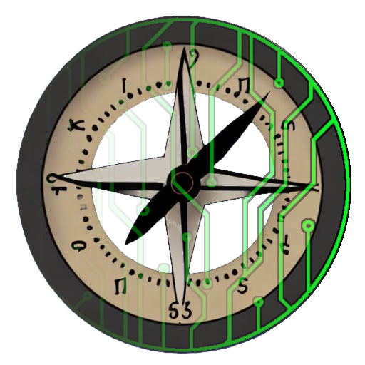

# Cartwright



Cartwright is a data profiler that identifies and categorizes spatial and temporal features. Cartwright uses deep learning, natural language processing, and a variety of heuristics to determine whether a column in a dataset contains spatial or temporal information and, if so, what is specifically contained.

Cartwright was built to automate complex data pipelines for heterogenous climate and geopolitical data that are generally oriented around geospatial and temporal features (_think maps and time series_). The challenge that Cartwright solves is automatically detecting those features so they can be parsed and normalized. This problem turns out to be quite tricky, but Cartwright makes it simple.

Cartwright can easily detect things like `country`, `day`, `latitude`, and many other location and time types. Check out Cartwright's [supported categories](https://jataware.github.io/cartwright/categories.html) for a complete listing!

Cartwright is easy to install and works with pretty much any tabular data. It's easy to add new categories too! Learn more about the methodology behind Cartwright, its API, and how to contribute in our [docs](https://jataware.github.io/cartwright).

## Installation

You can install Cartwright from PyPi with `pip install cartwright`.

## Using Cartwright

Imagine we have the following weather dataset:

| x_value  |  y_value   | recorded_at | rainfall |
|:---------|:----------:|------------:|--------|
| 7.942658 | 107.240322 | 07/14/1992  | .2     |
| 7.943745 | 137.240633 | 07/15/1992  | .1     |
| 7.943725 | 139.240664 | 07/16/1992  | .3     |


To the human observer, it's pretty obvious that `x_value` is the longitude column, `y_value` the latitude, `recorded_at` the date, and `rainfall` the actual weather measurement. However, if we're trying to automatically ingest this data into a weather model, we would benefit from knowing this _without human observation_. Enter Cartwright:

```    
from pprint import pprint
from cartwright import categorize

cartwright = categorize.CartwrightClassify()
categories = cartwright.categorize(path="path/to/data.csv")

pprint(categories, sort_dicts=False)
```    

We've now categoriezed each column in this dataset and have automatically determined which column represents latitude, longitude and date. We've also learned the time format (`%m/%d/%Y`) of the date feature.

```
{'x_value': {'category': <Category.geo: 'geo'>,
             'subcategory': <Subcategory.longitude: 'longitude'>,
             'format': None},
 'y_value': {'category': <Category.geo: 'geo'>,
             'subcategory': <Subcategory.latitude: 'latitude'>,
             'format': None},
 'recorded_at': {'category': <Category.time: 'time'>,
                'subcategory': <Subcategory.date: 'date'>,
                'format': '%m/%d/%Y'}}
```

With this information we can now convert the date values to a timestamp and plot a timeseries with other features.

## Resolution Detection

In addition to its ability to categorize spatial and temporal features, Cartwright can determine their resolution. For example, given a dataset like:

```
date,temperature(C)
2019-01-01 00:00:00, 10.2
2019-01-01 02:00:00, 11.7
2019-01-01 04:00:00, 12.3
...
2019-12-31 22:00:00, 10.1
```

Cartwright can detect it's temporal resolution:

```
Resolution(
    uniformity=Uniformity.PERFECT,
    unit=TimeUnit.HOUR,
    resolution=2.0,
    error=0.0,
)
```

For gridded data, which is common in the scientific domain, Cartwright can also determine the spatial resolution (grid size). Check out the docs to learn more about using Cartwright to detect [temporal resolution](https://jataware.github.io/cartwright/temporal_resolution.html) and [spatial resolution](https://jataware.github.io/cartwright/geospatial_resolution.html).