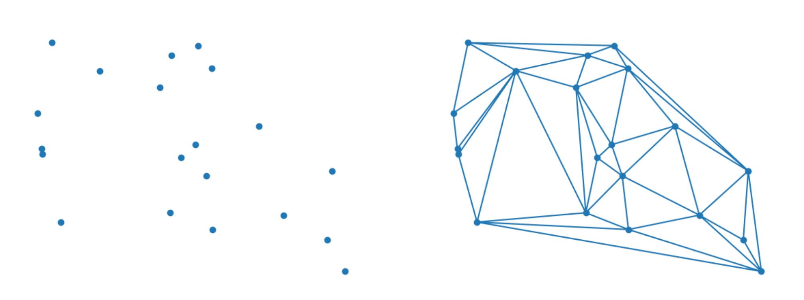
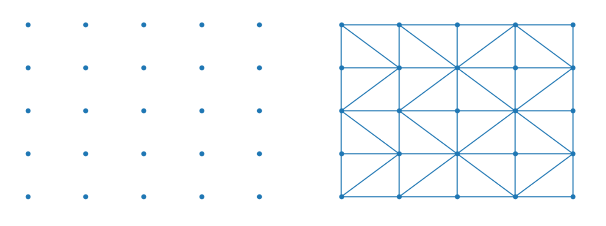

# GeoSpatial Resolution

In addition to detecting temporal resolution, Cartwright can also detect the spatial resolution of datasets that are on lat/lon grids over the earth. 


## Detection Process
Given data at lat/lon coordinates that form a regularly spaced grid, the grid resolution can be automatically detected. A simple heuristic is used to perform the analysis:
1. perform Delaunay triangulation on the lat/lon coordinates, generating a mesh connecting neighboring points
2. extract all edges from the mesh
3. filter for edges that are either vertical or horizontal (i.e. edges that are parallel to the lat/lon axes)
4. measure the lengths of the vertical and horizontal edges

If the majority of the edges are vertical or horizontal, and they have the same lengths, this indicates the presence of a regular grid

## Usage

Let's say we have a CSV with the following data in it:

```csv
date,lat,lon,temp(C)
2019-12-21, -90.0, -180.0, 0.31805327068527456
2019-12-21, -70.0, -180.0, 22.00639989706686
2019-12-21, -50.0, -180.0, 1.693544861446521
2019-12-21, -30.0, -180.0, 20.278347829058497
2019-12-21, -10.0, -180.0, 2.154975717111073
2019-12-21,  10.0, -180.0, 5.612021015365286
2019-12-21,  30.0, -180.0, 9.907249911696388
2019-12-21,  50.0, -180.0, 24.282954249447435
2019-12-21,  70.0, -180.0, 9.131751786999656
...
2019-12-21,  10.0,  120.0, 23.034205461419663
2019-12-21,  30.0,  120.0, 14.289416548417647
2019-12-21,  50.0,  120.0, 21.310145749570104
2019-12-21,  70.0,  120.0, 15.804599073744885
```

We can automatically detect the frequency of measurements

```
from cartwright import detect_latlon_resolution
import pandas as pd

# Load the data
df = pd.read_csv("path/to/data.csv")

# get the lat/lon coordinates from the dataframe
lat = df["lat"].to_numpy()
lon = df["lon"].to_numpy()

# detect the spatial resolution
resolution = detect_latlon_resolution(lat, lon)
```

The resulting object will contain the following results:

```
GeoSpatialResolution(
    square = Resolution(
        uniformity=Uniformity.PERFECT,
        unit=DistanceUnit.DEGREE,
        resolution=20.0,
        error=0.0,
    ),
    lat=None
    lon=None
)
```

Indicating that the data has a perfect uniform grid with a spacing of 20 degrees between each point.

## GeoSpatialResolution Object
Results from this utility are reported as a `GeoSpatialResolution` object. This object contains the following fields:
- `square`: (`Resolution`) object describing the resolution of the grid in the lat/lon axes
- `lat`: (`Resolution`) object describing the resolution of the grid in the lat axis
- `lon`: (`Resolution`) object describing the resolution of the grid in the lon axis

For most applications, the `square` field will be populated, since most data use the same spacing in both axes. However, if the data has a non-uniform grid, the `lat` and `lon` fields will be populated with the resolution of the grid in each axis.

If the detection process fails, the `GeoSpatialResolution` object will be `None`

## Resolution Object
Same as temporal resolution, geo-spatial resolutions are represented by a `Resolution` object with values: 
- `uniformity`: (enum) Measures how uniform the lat/lon intervals are (see below).
- `unit`: (enum) The unit of angle (e.g. degrees, minutes, seconds)
- `resolution`: (float) A multiplier on the unit, e.g. 20 degrees, 5 minutes, etc.
- `error`: (float) The mean error of the lat/lon intervals from the expected value.


## Uniformity
Uniformity captures how close to a perfect grid the lat/lon points are. 
- `UNIFORM`: all values spacings fall within `1e-9` the average spacing 
- `UNIFORM`: all values are within `1%` of the average spacing
- `NOT_UNIFORM`: any values fall outside of the above criteria

For geo-spatial grids of data, the uniformity metric should probably be ignored. Typically the grid detection process will only succeed if the grid was perfectly uniform. Otherwise a `None` result will be returned.

## Units of Angle
Cartwright supports the following units of angle:
- `degrees` (1)
- `minutes` (degrees / 60)
- `seconds` (degrees / 3600)


In the future, angle units will be drawn from a more comprehensive units ontology

## Delaunay Triangulation
This utility makes use of Delaunay triangulation to detect if points are on a regular grid. Given a set of points, Delaunay triangulation is a method for connecting points with their closest neighbors.

For example, starting with the random set of points on the left side, Delaunay triangulation will connect each point with its closest neighbors, resulting in the mesh on the right side.

Points that are uniformly spaced in lat/lon coordinates generate a mesh that is extremely regular.

The edges that are extracted from the uniform mesh are either vertical, horizontal, or diagonal. Thus, if a large enough proportion of the edges are vertical or horizontal, we can infer that the grid is regular, and then measure the resolution based on the lengths of the vertical and horizontal edges.
