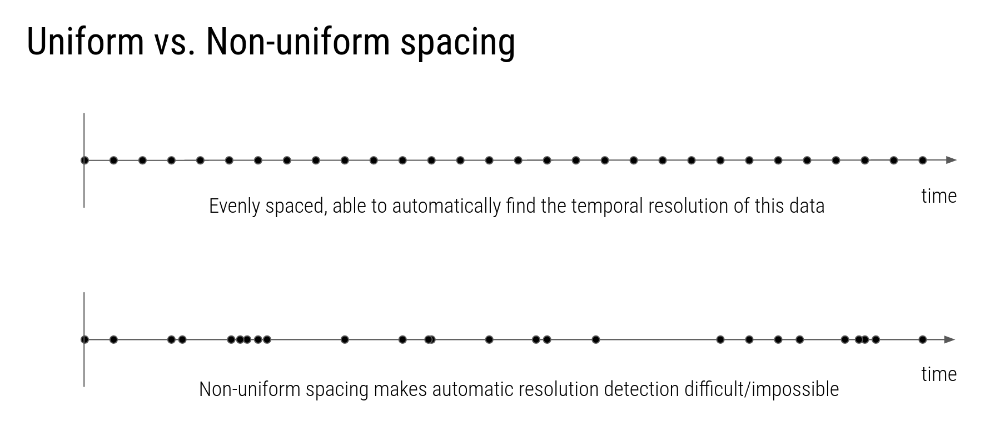

# Temporal Resolution

One of Cartwright's capabilities is to predict the temporal resolution of a given feature column. For example, if you have a column of dates, Cartwright can tell you whether the dates are in days, months, or years, as well as identify if there are any gaps or irregularities in the data.

Temporal resolution detection is a sub-problem in the larger problem of dataset alignment: given two datasets with possibly different temporal resolutions, how can we align them so that they can be compared? Cartwright's temporal resolution detection is a first step in this process.

## Detection Process
During the `columns_classified()` process if a dataset contains data at evenly spaced time intervals, the resolution is automatically detected. A simple heuristic is used to perform the analysis:
1. convert all unique dates/times to unix timestamps
2. sort the timestamps and compute the delta time between each
3. find the median of the deltas
4. characterize the uniformity of the deltas
5. find the closest matching time unit from a preset list
6. convert the median delta to a proportion of the matched unit, and set as the temporal unit for the dataset

Time resolutions are represented by a `TimeResolution` object with values: `uniformity` enum, `unit` enum, `density` value (in the unit given), and mean `error` value. If the detection process fails, the object will be `None`

In addition to detecting data precisely matching known units, such as hours, days, years, etc. Cartwright can also detect data at fractional units, such as `6 hours`, `3.5 days`, `1.25 years`, etc. In these cases, the time unit will be set to the closest matching unit, and the density will be set to the fractional amount of that unit.

## Uniformity
Uniformity captures whether temporal resolution is a coherent property for the given feature. 

Depending on the application, some slight level of non-uniformity may be acceptable. Cartwright classifies temporal uniformity as one of three categories:
- `UNIFORM`: all values spacings fall within `1e-9` the average spacing 
- `UNIFORM`: all values are within `1%` of the average spacing
- `NOT_UNIFORM`: any values fall outside of the above criteria

For most applications, `PERFECTLY_UNIFORM` and `UNIFORM` are good enough. And in fact, for some units of time, `PERFECTLY_UNIFORM` may not occur at all. E.g. years may contain leap days which then cause that columns to be identified as `UNIFORM`, even if the values are perfectly uniform. Similar effects happen dues to daylight savings time, etc.

## Units of Time
Cartwright supports the following units of time:
- ~~`millisecond` (1e-3 * second)~~
- `second` (1)
- `minute` (60 * second)
- `hour` (60 * minute)
- `day` (24 * hour)
- `week` (7 * day)
- `year` (365 * day)
- `month` (year / 12)
- `decade` (10 * year + 2 * day)
- `century` (100 * year + 24 * day)
- `millennium` (1000 * year + 242 * day)

In the future, temporal units will be drawn from a more comprehensive units ontology

Currently milliseconds may experience issues due to floating point precision errors, and thus may not be detected by this process.